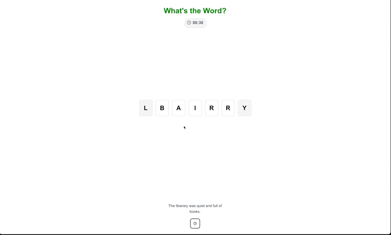

# What's the Word?

Welcome to What's the Word (WTW) - an addictive word puzzle game that will put your brain to the test! 🧩

Ever notice how you can still read words even when the middle letters are jumbled? That's because your brain is amazing at recognizing patterns! WTW turns this fascinating phenomenon into an exciting challenge - drag and arrange the scrambled letters into the correct order as quickly as you can. The first and last letters stay fixed, but everything in between is up to you to solve.

Race against the clock ⏱️ and challenge yourself to unscramble words faster and faster. How quickly can you spot the hidden word? Jump in and find out!




## Getting Started

First, run the development server:

```bash
npm run dev
# or
yarn dev
# or
pnpm dev
# or
bun dev
```

Open [http://localhost:3000](http://localhost:3000) with your browser to see the result.

You can start editing the page by modifying `app/page.tsx`. The page auto-updates as you edit the file.

This project uses [`next/font`](https://nextjs.org/docs/app/building-your-application/optimizing/fonts) to automatically optimize and load [Geist](https://vercel.com/font), a new font family for Vercel.
